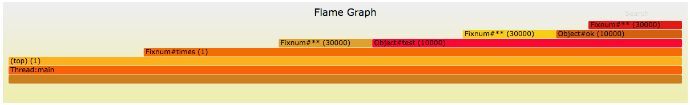

# JRuby::Profiler::FlameGraphProfilePrinter

This is a JRuby Profiler Printer that will dump a profile into a form for usage with FlameGraph.
It only builds a FlameGraph from the thread that wraps the profiler, because I'm not sure the JRuby
profiler supports multiple threads right now.

## Installation

    $ gem install jruby-profiler-flame_graph_profile_printer

## Example

```ruby
require "jruby/profiler/flame_graph_profile_printer"

def ok
  3 ** 3
end

def test
  ok ** 3
end

result = JRuby::Profiler.profile do
  # Do some expensive stuff.
  10_000.times do
     test ** 3
  end
end

printer = JRuby::Profiler::FlameGraphProfilePrinter.new(result)
printer.printProfile(STDOUT)
```

## Usage

```
# Assuming you have the above example saved as "powers.rb".
jruby --profile.api powers.rb | ./FlameGraph/flamegraph.pl > output.svg
```

Where `./FlameGraph/flamegraph.pl` is a cloned version of [FlameGraph](https://github.com/brendangregg/FlameGraph).



**Here's a slightly more complex example:**


## Contributing

Bug reports and pull requests are welcome on GitHub at https://github.com/film42/jruby-profiler-flame_graph_profile_printer. This project is intended to be a safe, welcoming space for collaboration, and contributors are expected to adhere to the [Contributor Covenant](http://contributor-covenant.org) code of conduct.

## License

The gem is available as open source under the terms of the [MIT License](http://opensource.org/licenses/MIT).
